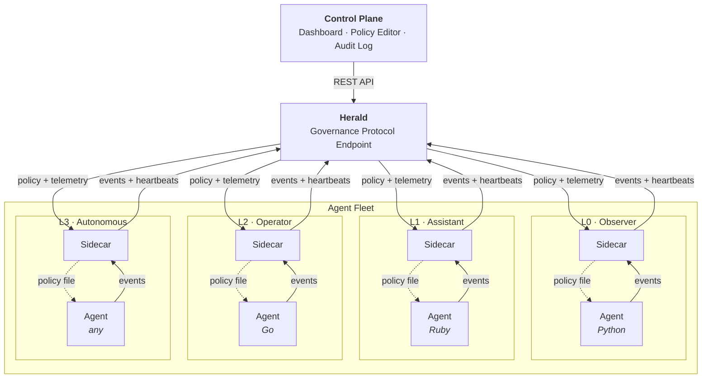

# Herald

Governance protocol for AI agent fleets. Manages the boundary around agents — not the agents themselves.

Any language. Any framework. Any runtime. Herald defines the contract: **policy in, events out, enforcement at the infrastructure level.**

## What Herald Does

1. **Registers agents** and issues sidecar tokens
2. **Distributes policy** (tier, allowed actions, rate limits) to agent sidecars
3. **Ingests events** from agents via sidecars for audit trails
4. **Collects telemetry** (RTT, jitter, runtime claims) for integrity scoring
5. **Serves a dashboard** for fleet visibility and governance

## Architecture



Each agent runs with a **sidecar** — a lightweight process that handles all Herald protocol communication. The agent only needs to:

1. **Read a local policy file** (written by the sidecar)
2. **POST events to localhost** (forwarded by the sidecar to Herald)

## Quick Start

```bash
# Clone and install
git clone https://github.com/watthem/herald.git
cd herald
python -m venv .venv && source .venv/bin/activate
pip install -e .

# Start Herald
uvicorn herald.app:app --port 59237

# In another terminal — register example agents
python examples/register-fleet.py

# Open the dashboard
open http://localhost:59237/dashboard
```

## Integrate Your Agent (3 Lines)

Your agent reports events to the sidecar at `http://localhost:9100/events`:

**Python:**
```python
import httpx
def report(action, target, result="success"):
    httpx.post("http://localhost:9100/events", json={
        "action": action, "target": target, "result": result,
    })
```

**Ruby:**
```ruby
require 'net/http'; require 'json'
def report(action, target, result = "success")
  Net::HTTP.post(URI("http://localhost:9100/events"),
    { action: action, target: target, result: result }.to_json,
    "Content-Type" => "application/json")
end
```

**curl:**
```bash
curl -X POST http://localhost:9100/events \
  -H "Content-Type: application/json" \
  -d '{"action":"test","target":"test","result":"success"}'
```

## Autonomy Tiers (L0–L3)

| Tier | Label | What the Agent Can Do |
|------|-------|-----------------------|
| L0 | Observer | Read-only, no network, no writes |
| L1 | Assistant | Read data via Herald |
| L2 | Operator | Read/write within scope, HITL gate on writes |
| L3 | Autonomous | Full action within policy boundary |

Tiers are enforced at the container and network level — not by prompts.

## Project Structure

```
herald/
├── herald/          # Python package
│   ├── app.py       # FastAPI app (mounts v1 + serves dashboard)
│   └── v1/          # Governance protocol endpoints
├── sidecar/         # Reference sidecar (zero-dep Python)
├── dashboard/       # Fleet dashboard (single HTML file)
├── docs/            # Protocol spec, architecture, design system
└── examples/        # Ruby agent, fleet registration, Claude Code hook
```

## Documentation

- [Protocol Specification](docs/PROTOCOL.md) — Herald contract: events, policy, telemetry, API
- [Architecture](docs/ARCHITECTURE.md) — System design and threat model
- [Sensor Integration](docs/sensor-integration.md) — Adding hardware-level integrity signals
- [Design System](docs/DESIGN.md) — UI tokens and component catalog

## Test Quality Guard

Use the built-in guard to catch low-value coverage padding before merge:

```bash
python3 scripts/check_test_quality.py
```

The guard fails on:

1. Tautological assertions (for example `assert True`)
2. Tests with no assertions
3. Excessive status-code-only tests

## Release Tags

Release workflow expects tags in this format:

1. `YYYY-MM-DD.POC`
2. `YYYY-MM-DD.DEV`
3. `YYYY-MM-DD.BETA`
4. `YYYY-MM-DD.STABLE`

Channel behavior:

1. `POC`: smoke gate only (`3.12`)
2. `DEV/BETA/STABLE`: smoke gate (`3.12`) plus compatibility gate (`3.11`)

## License

MIT
