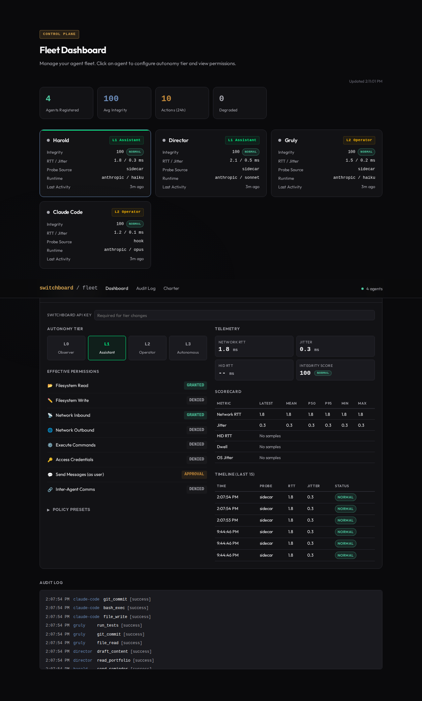

# Dashboard Setup

Switchboard serves a fleet integrity dashboard as a single HTML page — no build tools, no JS framework, no external dependencies.

---

## Accessing the Dashboard

Start Switchboard and navigate to:

```
http://localhost:59237/dashboard
```

The dashboard is served directly by the Switchboard API. No separate build step or static file server needed.

## What the Dashboard Shows


### Fleet Overview

- **Agents Registered** — total count
- **Avg Integrity** — mean integrity score across the fleet
- **Actions (24h)** — total events in the last day
- **Degraded** — agents with integrity below threshold

### Agent Cards

Each registered agent shows:

- Integrity score and status badge (normal / elevated / degraded / unknown)
- Network RTT and jitter from latest telemetry
- Probe source (sidecar, sensor, hook, manual)
- Runtime claims (provider, model, region)
- Last activity timestamp

### Agent Detail Panel

Click an agent card to see:



- **Tier selector** — change the agent's autonomy tier (requires admin key)
- **Permission grid** — allowed and denied actions
- **Telemetry scorecard** — RTT/jitter statistics (min, max, p50, p95)
- **Telemetry timeline** — recent integrity scores over time

## Tier Changes via Dashboard

1. Click an agent card
2. Enter your admin API key
3. Select a new tier or integrity preset
4. Changes apply immediately — the sidecar picks up the new policy on its next sync

## Design System

The dashboard uses design tokens from `docs/shared.css` — a dark-theme system with desaturated teal, gold, and blue accents. See the [Design System](DESIGN.md) reference for the full token catalog.

## Customization

The dashboard is a single HTML file at `dashboard/index.html`. It fetches data from the Switchboard API using standard `fetch()` calls. You can modify it directly — no build step required.
