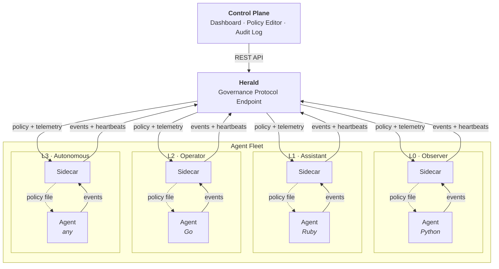

# Herald

<figure markdown="span">
  { width="600" }
</figure>

**Governance protocol for AI agent fleets.** Manages the boundary around agents — not the agents themselves.

Any language. Any framework. Any runtime. Herald defines the contract: **policy in, events out, enforcement at the infrastructure level.**

---

## What Herald Does

1. **Registers agents** and issues sidecar tokens
2. **Distributes policy** (tier, allowed actions, rate limits) to agent sidecars
3. **Ingests events** from agents via sidecars for audit trails
4. **Collects telemetry** (RTT, jitter, runtime claims) for integrity scoring
5. **Serves a dashboard** for fleet visibility and governance

## Architecture



Each agent runs with a **sidecar** — a lightweight process that handles all Herald protocol communication. The agent only needs to:

1. **Read a local policy file** (written by the sidecar)
2. **POST events to localhost** (forwarded by the sidecar to Herald)

## Quick Start

```bash
git clone https://github.com/watthem/herald.git
cd herald
python -m venv .venv && source .venv/bin/activate
pip install -e .
uvicorn herald.app:app --port 59237
```

Then open [http://localhost:59237/dashboard](http://localhost:59237/dashboard).

See the full [Quickstart guide](quickstart.md) for agent registration and integration.

## Integrate Your Agent (3 Lines)

Your agent reports events to the sidecar at `http://localhost:9100/events`:

=== "Python"

    ```python
    import httpx
    def report(action, target, result="success"):
        httpx.post("http://localhost:9100/events", json={
            "action": action, "target": target, "result": result,
        })
    ```

=== "Ruby"

    ```ruby
    require 'net/http'; require 'json'
    def report(action, target, result = "success")
      Net::HTTP.post(URI("http://localhost:9100/events"),
        { action: action, target: target, result: result }.to_json,
        "Content-Type" => "application/json")
    end
    ```

=== "curl"

    ```bash
    curl -X POST http://localhost:9100/events \
      -H "Content-Type: application/json" \
      -d '{"action":"test","target":"test","result":"success"}'
    ```

## License

MIT
